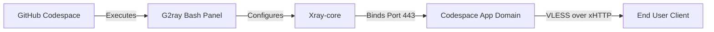

<div align="center">

# G2rayXCodeLeafy

A sleek VLESS proxy manager for GitHub Codespaces.

[](https://github.com/Code-Leafy/G2rayXCodeLeafy)
[](https://github.com/Code-Leafy/G2rayXCodeLeafy)
[]()

</div>

---

<div align="center">

<!-- 🎬 Quick Start Tutorial Video -->
https://github.com/user-attachments/assets/79174a4a-ef86-4c1d-9f1a-909d0b29a248

<br>

<!-- 📸 Panel Preview Image -->


</div>

<br>

## Overview

G2ray is a powerful, interactive Bash panel designed to instantly deploy and manage Xray VLESS XHTTP configurations. Built specifically for the GitHub Codespaces environment, it automates port management, traffic monitoring, and connection keep-alives natively.

> **Note:** The panel includes an advanced anti-sleep engine using Tmux to prevent your free-tier Codespace from hibernating while the proxy is in use.

---

<summary><kbd>🔗</kbd> Community Donated Configs (SUB)</summary>

Want to use public nodes donated by other G2ray users? Import this subscription link directly into your V2ray/Xray client:

```text
https://raw.githubusercontent.com/Code-Leafy/G2rayXCodeLeafy/main/configs.txt
```

---

### Core Features

#### ⚡ One-Click Deploy & Manage
Generate and start Xray engines in seconds. The beautiful menu-driven CLI interface makes managing nodes and viewing live config links effortless. 

#### 🔄 Smart Auto-Keepalive
Built-in background loops and advanced Tmux simulators prevent GitHub Codespaces from shutting down due to inactivity, keeping your tunnel open.

#### 📡 Live Analytics & Quota
Tracks real-time RX/TX data consumption and actively monitors resource usage (CPU/RAM). It accurately estimates your remaining 60-hour free-tier quota.

#### 📦 Community Config Network
Donate your generated config directly from the CLI to share access with the community securely, without impacting your own speed or exposing personal data.

<div align="center">

| 🛠️ Configuration Optimizer |
| :--- |
| To finalize your setup, take the config received from the panel and visit **[NetLeafy](https://code-leafy.github.io/NetLeafy)**. Set the server mode to **G2ray** and paste your link to generate a fully optimized connection. |

</div>

---


## Getting Started

1. **Fork the Repository**  
   → Click **Fork** at the top-right of this page

2. **Create a Codespace**  
   → Open your fork → Click **Code** → **Codespaces** tab → **Create codespace on main**

3. **Wait for Environment**  
   → Allow 2-3 minutes for the container to build

4. **Launch Panel**  
   → The G2ray CLI panel auto-starts in the terminal!

<details>
<summary><kbd>⚙️</kbd> Environment Configuration</summary>

While G2ray is designed to be zero-config, advanced users can modify specific variables within the engine script:

- `XRAY_PORT` **(Optional)** — Binds Xray to a custom port. Default: `443`
- `CODESPACE_NAME` **(Optional)** — Overrides auto-detection of the app domain.

</details>

---

## Usage

When launched, the panel provides a 1-to-13 numerical selection menu. Simply type the number corresponding to the action you want to take.

```bash
# If panel did now get shown:
bash ./g2ray.sh
```

### Safer Reproducible Settings

- Set `G2RAY_AUTO_UPDATE=1` only when you want the panel to replace `g2ray.sh` from upstream on startup. It is disabled by default.
- Override the devcontainer build argument `XRAY_VERSION` to change the pinned Xray-core version. Default: `v26.5.9`.

---

## Architecture



<details>
<summary><kbd>📁</kbd> Project Structure</summary>

```text
G2rayXCodeLeafy/
├── data/                    # Dynamic storage for usage stats, UUIDs, & config
├── logs/                    # Xray engine error logs
├── assets/                  # Media resources (previews & videos)
├── configs.txt              # Community donated subscription configs
└── g2ray.sh                 # The main interactive panel script
```

</details>

---

<details>
<summary><kbd>❓</kbd> FAQ & Troubleshooting</summary>

**My Codespace keeps shutting down?**
Ensure you have activated Option `7` in the G2ray panel (Toggle Anti-Sleep Mode) to spawn a background Tmux session that simulates user activity.

**Why are my speeds slow?**
For optimal routing, always try to ensure your GitHub Codespace region is set to `Europe West` in your GitHub account settings, as this places the server in NL/DE.

</details>

<br>

<div align="center">

> **⚠️ Educational Purpose Only:** This project is provided for educational and research purposes. Users are solely responsible for compliance with all local laws. The developer assumes no liability for misuse.

[MIT License](https://github.com/Code-Leafy/G2rayXCodeLeafy/blob/main/LICENSE) · Crafted by [Code-Leafy](https://github.com/Code-Leafy)
</div>
